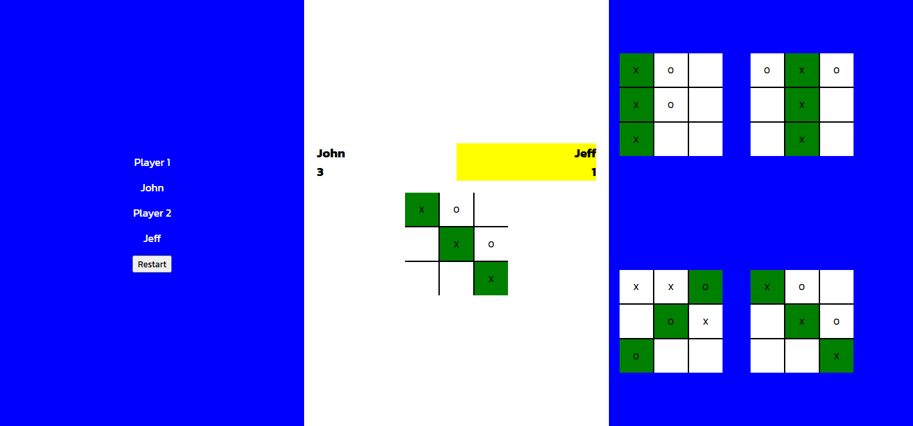

# Classic 2 player tic-tac-toe game.

### How to play

- [Click Here to Access the Game](https://deusbalatro.github.io/tictactoe)
- Set names for players.
- First player marks with X and second one marks with O
- First player starts
- The name of the player whose turn it is will be highlighted in yellow
- Won boards will be appeared on the right side of the page
- The first to reach 3 points wins.
- Click the restart button if you want to play again.

